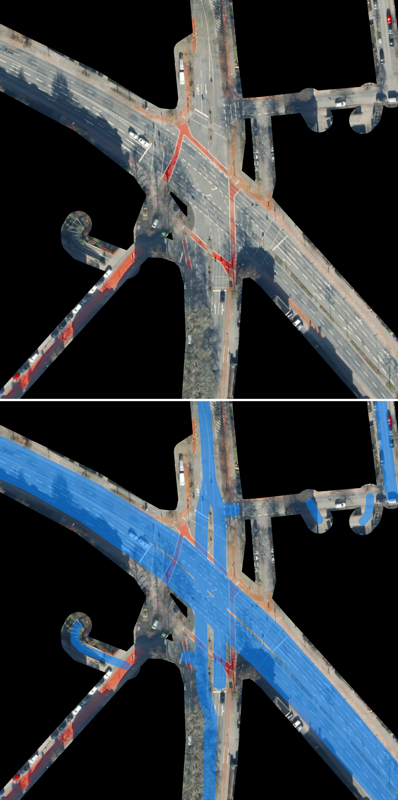
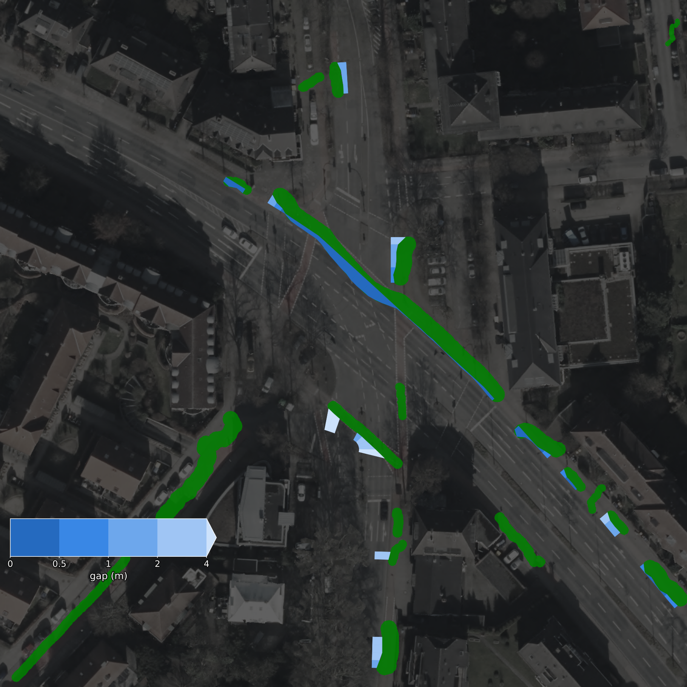

# Pipeline walkthrough: one worked example

*Auto-generated by `scripts/generate_pipeline_report.py`. Do not edit by hand; regenerate after any
pipeline change with:*

```bash
uv run python -m scripts.diagnostics.generate_pipeline_report
```

*Generated 2026-07-22 16:30 UTC from commit `904c90a`.*

Every stage below runs on the same fixed example region:

- **Tile:** `dop10rgbi_32_406_5758_1_nw_2026`
- **Pixel window:** x=5378, y=2079, w=1750, h=1750
- **Choice of region:** the area used throughout this project's development to validate each stage
- **Purpose of this document:** a visual trail through the pipeline for reference in writeups; see
  `README.md` for the full technical writeup

## 1. Raw input imagery

- **Content:** unmodified source tile crop (`data/input/dop10rgbi_32_406_5758_1_nw_2026.jp2`)


## 2. OSM road/bike-lane buffer mask

- **Geometry source:** OSM features queried via `osmnx` and buffered per `BIKE_LANE_BUFFER_METERS` /
  `STREET_BUFFER_METERS` (`scripts/osm_features.py`, `scripts/mask.py`), overlaid on the raw imagery
- **Red overlay:** dedicated bike-lane buffer
- **Blue overlay:** general street buffer
- **Effect on prefiltering:** survival of only those pixels inside one of these buffers


## 3. Shadow detection

- **Method:** blue-excess index, Otsu threshold, and morphological cleanup (`scripts/shadows.py`),
  overlaid in yellow
- **Current config:** `SHADOW_HANDLING="none"`, hence recording of the detected shadow (see "Output
  format" in `README.md`) without any modification of the imagery itself
- **Role of this figure:** completeness of what the pipeline detects, rather than a stage currently
  acted on


## 4. Red-saturation boost

- **Top:** raw imagery
- **Bottom:** result of `scripts/redness.py`'s saturation boost on reddish (bike-lane paint) pixels
  within the buffer mask


## 5. Prefiltered output

- **Content:** actual output of the prefiltering stage (`data/output/*.tif`, RGB bands)
- **Downstream use:** input to all detection stages, in place of the raw source tile


## 6. Texture-embedding CNN scan

- **Detector:** `TextureEmbeddingDetector`, a frozen Swin V2-B backbone with `discriminant_score`
  classification (see the "Texture-embedding detector" section of `README.md`)
- **Operation:** sliding-window scan of the prefiltered crop
- **Top:** RGB
- **Middle:** continuous discriminant-score heatmap (red = bikelane-side, blue = negative-side)
- **Bottom:** thresholded detection mask at window-block resolution, not yet precise enough for width
  measurement


## 7. Edge tracing, shape regularization, and bridging

- **Detector:** `BikeLaneEdgeDetector` (`scripts/detection/edge_trace.py`)
- **Processing steps:** classical color thresholding within the CNN's coarse region, PCA-binned
  centerline extraction, constant-width band reconstruction, and directional bridging across gaps
  (parked cars, shadow)
- **Top:** RGB
- **Middle:** coarse CNN mask, for reference only; its shape is the scan window's footprint, not the
  lane's
- **Bottom:** final pixel-precise, regularized, bridged mask


## 8. Road surface (OSM-width fallback)

- **Source:** `USE_OSM_ROAD_FALLBACK` is on, so the CNN road detector is skipped entirely. Each OSM
  street is buffered to half a default width for its `highway` class (`OSM_ROAD_DEFAULT_WIDTH_M`,
  `scripts/detection/osm_road_surface.py`) and rasterised as the road surface -- see "OSM-width
  fallback" under "Road detection" in `README.md`.
- **Top:** RGB
- **Bottom:** the assumed road surface (blue), a class-width band centred on each OSM centerline



**No width is measured here.** The surface is exactly the class-width buffer, so a width measured
against it would only echo the assumption back -- so under this flag `scripts.measurement.detect_roads` skips
width measurement entirely and writes just the surface, no width map or GeoPackage. This is the
region-of-interest-as-measurement trade the CNN path avoids on purpose; the fallback is kept only for
coverage, when a detected surface is worse than a sensible per-class guess. The per-class widths in
`OSM_ROAD_DEFAULT_WIDTH_M` are the one thing to tune for a new area.

**Surface assumed on this frame:** 606,551 px across 5 street buffer(s).

## 9. road-to-bike-lane gap

- **Orchestrator:** `scripts.measurement.measure_bikelane_gap`, measuring in 1-D directly on the **raw** tile, at
  the imagery's own 0.1 m resolution -- see "Bike-lane gap" in `README.md`
- **Bike lanes from imagery, not OSM:** lane centrelines are detected by the colour edge tracer
  (`detection/bikelane_centerlines.py`, the same trace as step 7), so a lane OSM never mapped is still
  measured and one it misplaced is not measured in the wrong spot; only the *road* comes from OSM
- **Road edge from OSM (`USE_OSM_ROAD_FALLBACK`):** the road edge is taken from the road's
  highway-class width, at half-width along the cross-section, *not* from pixels. The lane edge and the
  separating strip between are still measured from the imagery, so the gap reads as the distance from
  the *assumed* road edge to the *measured* lane
- **Reading the figure:** green is the detected bike lane, flat, since it is an identity rather than a
  magnitude. The ribbon running off it is the gap, and it alone carries the blue scale inset at bottom
  left -- deep blue where the lane is flush with the road, brightening as the two pull apart, since a
  scale on dark imagery has to ascend into light rather than into black. The ribbon's far edge is
  where the assumed road was taken to end. The road surface itself is not drawn (`GAP_MAP_SHOW_ROAD`), since under the OSM fallback it is a class-width assumption, and drawn solid it reads as the most confident object on a map where it is the least measured one. Every cross-section is drawn: the road edge
  comes from OSM, which shadow cannot obscure, so nothing is withheld as unmeasurable



**On this frame:** 88 of 98 cross-sections measured, 10 in
shadow; median gap 0.05 m, and 48% with no separating strip
at all (42 contiguous, 36 abutting, 8 asphalt, 1 red paint, 1 bright/marking). That most lanes read 0 m is the real picture of the district: most cycling
infrastructure here is painted onto or flush with the road. A gap only opens up where a verge,
buffer or paved strip physically separates the two -- those are the coloured stretches.

**`contiguous` is "no separating strip detected", not a certified zero.** A paint line fainter than
`MARKING_MIN_EXCESS`, or a low-contrast material change, would be missed and also land at 0 m. The
`composition` field keeps the distinction (`contiguous` = no boundary found, vs `abutting` = boundary
found with zero strip) so it can be audited; putting an error bar on it would need ground-truth
cross-sections.
