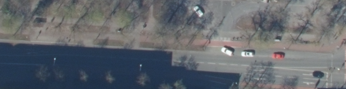
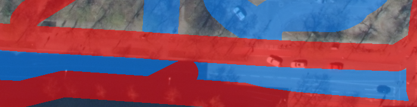
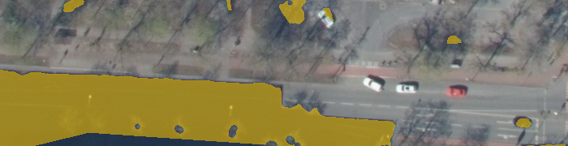
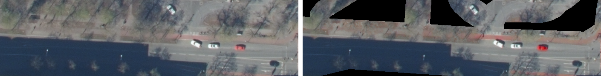
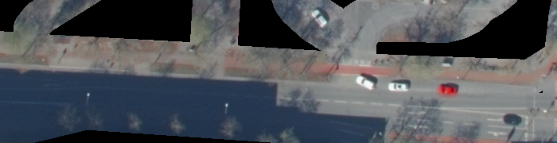
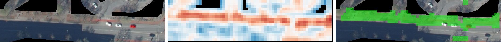
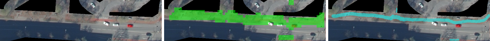

# Pipeline walkthrough: one worked example

*Auto-generated by `scripts/generate_pipeline_report.py`. Do not edit by hand; regenerate after any
pipeline change with:*

```bash
uv run python -m scripts.generate_pipeline_report
```

*Generated 2026-07-19 09:16 UTC from commit `20d4148`.*

Every stage below runs on the same fixed example region:

- **Tile:** `idop20rgbi_32_404_5757_1_nw_2025`
- **Pixel window:** x=4300, y=1330, w=750, h=180
- **Choice of region:** the area used throughout this project's development to validate each stage
- **Purpose of this document:** a visual trail through the pipeline for reference in writeups; see
  `README.md` for the full technical writeup

## 1. Raw input imagery

- **Content:** unmodified source tile crop (`data/input/idop_kacheln/idop20rgbi_32_404_5757_1_nw_2025.jp2`)



## 2. OSM road/bike-lane buffer mask

- **Geometry source:** OSM features queried via `osmnx` and buffered per `BIKE_LANE_BUFFER_METERS` /
  `STREET_BUFFER_METERS` (`scripts/osm_features.py`, `scripts/mask.py`), overlaid on the raw imagery
- **Red overlay:** dedicated bike-lane buffer
- **Blue overlay:** general street buffer
- **Effect on prefiltering:** survival of only those pixels inside one of these buffers



## 3. Shadow detection

- **Method:** blue-excess index, Otsu threshold, and morphological cleanup (`scripts/shadows.py`),
  overlaid in yellow
- **Current config:** `SHADOW_HANDLING="none"`, hence recording of the detected shadow (see "Output
  format" in `README.md`) without any modification of the imagery itself
- **Role of this figure:** completeness of what the pipeline detects, rather than a stage currently
  acted on



## 4. Red-saturation boost

- **Left:** raw imagery
- **Right:** result of `scripts/redness.py`'s saturation boost on reddish (bike-lane paint) pixels
  within the buffer mask



## 5. Prefiltered output

- **Content:** actual output of the prefiltering stage (`data/output/*.tif`, RGB bands)
- **Downstream use:** input to all detection stages, in place of the raw source tile



## 6. Texture-embedding CNN scan

- **Detector:** `TextureEmbeddingDetector`, a frozen Swin V2-B backbone with `discriminant_score`
  classification (see the "Texture-embedding detector" section of `README.md`)
- **Operation:** sliding-window scan of the prefiltered crop
- **Left:** RGB
- **Middle:** continuous discriminant-score heatmap (red = bikelane-side, blue = negative-side)
- **Right:** thresholded detection mask at window-block resolution, not yet precise enough for width
  measurement



## 7. Edge tracing, shape regularization, and bridging

- **Detector:** `BikeLaneEdgeDetector` (`scripts/detection/edge_trace.py`)
- **Processing steps:** classical color thresholding within the CNN's coarse region, PCA-binned
  centerline extraction, constant-width band reconstruction, and directional bridging across gaps
  (parked cars, shadow)
- **Left:** RGB
- **Middle:** coarse CNN mask, for reference only; its shape is the scan window's footprint, not the
  lane's
- **Right:** final pixel-precise, regularized, bridged mask



## 8. Width measurement

- **Method:** per-segment width statistics via skeletonization and distance transform
  (`scripts/detection/width.py`)
- **Input:** the final regularized mask from step 7

| segment | px     | mean (m) | median (m) | min (m) | max (m) | n samples |
| ------- | ------ | -------- | ---------- | ------- | ------- | --------- |
| 0       | 10,005 | 2.81     | 2.80       | 2.04    | 3.60    | 677       |
| 1       | 327    | 1.60     | 1.60       | 1.26    | 1.65    | 36        |
| 2       | 105    | 1.17     | 1.20       | 0.89    | 1.20    | 16        |
